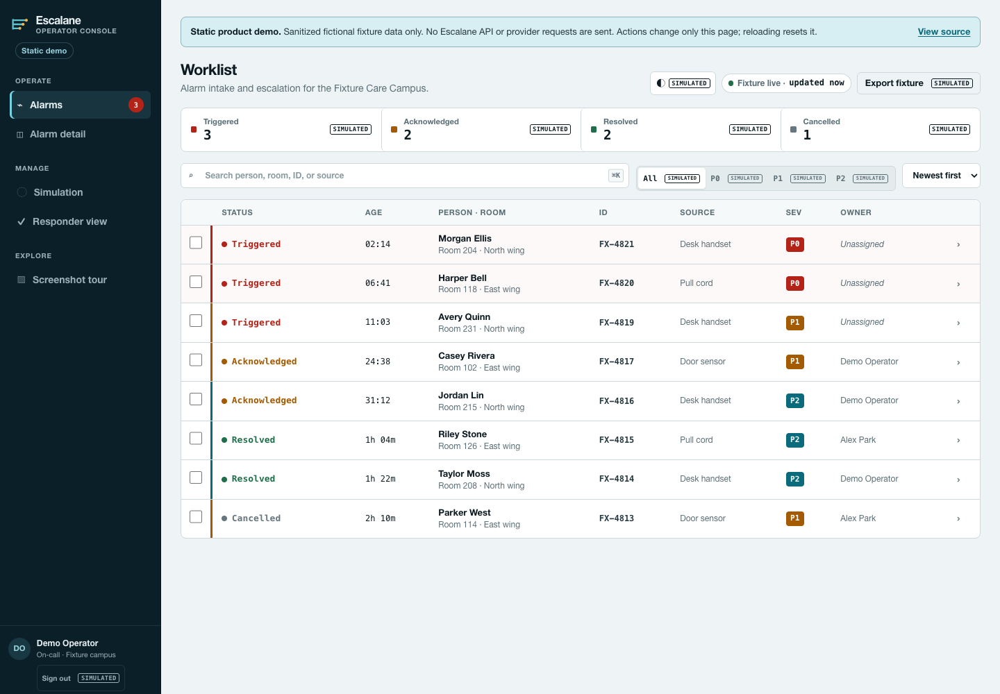
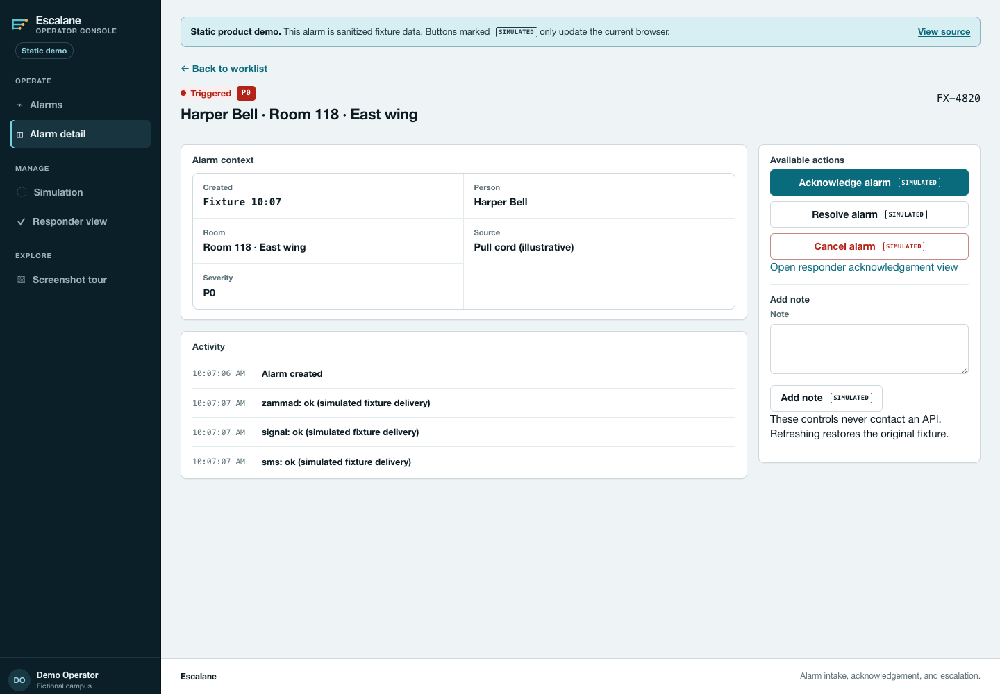
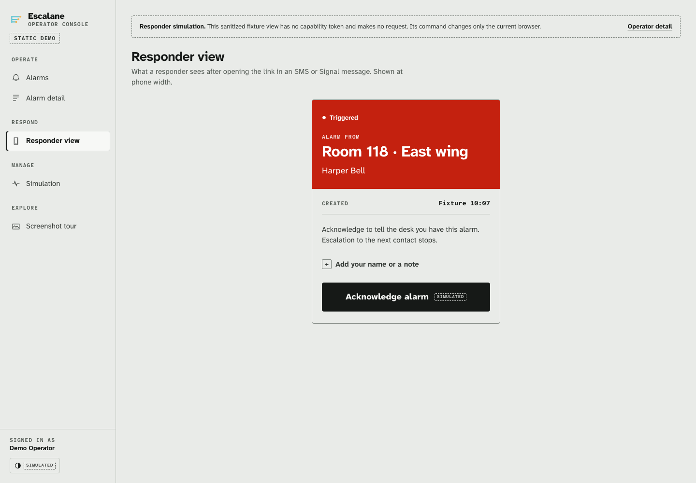
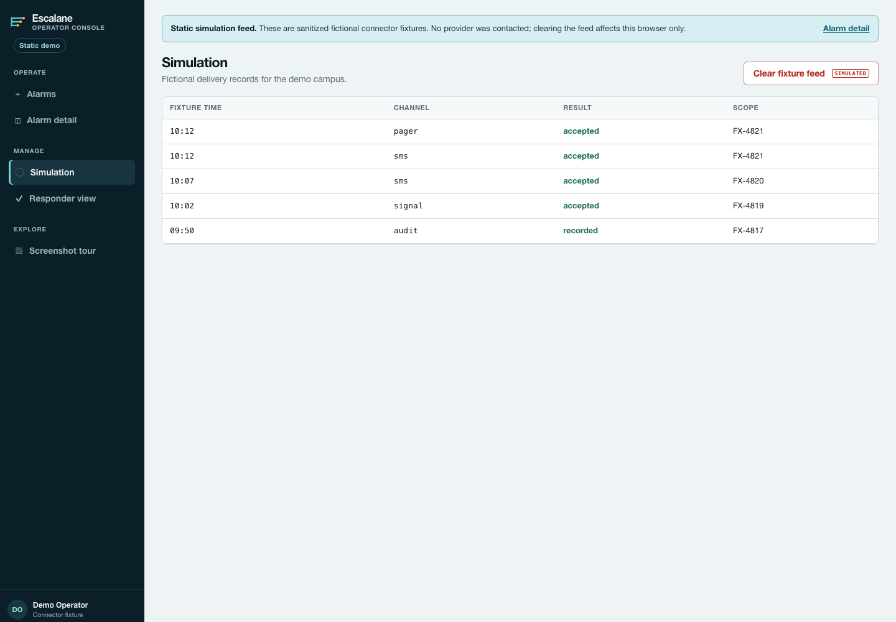

# Escalane

Escalane turns device alarm triggers into a worklist for operators and
acknowledgement links for responders. It records each alarm’s history in
PostgreSQL and uses background workers to send notifications and escalate
unanswered alarms. You can also configure the service and manage alarms through its API.

Escalane is a public alpha intended for evaluation. It has not been validated
for emergency response or uses that require safety, security, or compliance
assurance.

Try the [interactive browser demo](https://sebastianspicker.github.io/escalane/)
to explore the worklist, inspect an alarm, and try the responder flow with
fictional data. It runs entirely in your browser, without credentials or
connections to Escalane or its notification providers.

## Who it fits

Escalane is for developers and operators evaluating a self-hosted alarm workflow.
Sites, rooms, people, devices, notification targets, and escalation steps are
configurable; the sample campus is only an example. Devices currently submit alarms over Yealink-compatible HTTP. Supporting
another device protocol requires an adapter.

The demo’s pull cords, door sensors, and pager entries illustrate a workflow;
they are not supported hardware or provider integrations. See
[Integrations](docs/INTEGRATIONS.md) for what is implemented.

## Screenshot tour

These screenshots show the static demo with fictional people and alarms.
The demo uses the application’s styles; no notifications are sent.
Open the [guided tour](https://sebastianspicker.github.io/escalane/tour.html)
or try each screen below.

### 1. Find an alarm

Filter the worklist by status or severity, search for a room or person, and
open a row to inspect it. [Try the worklist](https://sebastianspicker.github.io/escalane/).



### 2. Review its history

Read the alarm details and timeline, add a note, or try acknowledging,
resolving, or cancelling it. [Try alarm detail](https://sebastianspicker.github.io/escalane/alarm.html).



### 3. Acknowledge as a responder

The responder view focuses on confirming receipt, with an optional name and note.
[Try acknowledgement](https://sebastianspicker.github.io/escalane/acknowledge.html).



### 4. Inspect sample deliveries

The simulation feed shows fictional delivery records. Clearing it affects only
the current page. [Try the feed](https://sebastianspicker.github.io/escalane/simulation.html).



## What it does

- Accepts Yealink-compatible HTTP triggers with a token for each device, an IP
  allowlist, rate limits, and idempotency handling for repeated requests.
- Lets operators acknowledge, resolve, cancel, annotate, and soft-delete alarms,
  manage configuration, and review the audit history.
- Records pending events in a transactional outbox. A separate ARQ worker sends
  them in order, recovers interrupted work, and records delivery outcomes.
- Connects to Zammad, SendXMS, and Signal REST, and supports signed callbacks and
  generic webhooks to allowed hosts.
- Provides English and German interfaces for operators and responders, with a
  local simulation mode for trying the workflow.

Delivery is at least once: a provider may receive the same request more than
once after a retry. Integrations need to handle those duplicates.

## Prerequisites

The Compose quick start requires Docker Engine with the Compose plugin. Local
Python development requires CPython `3.14.7`, GNU Make, and pip; the
Makefile creates and uses `.venv`. The package supports Python `>=3.14,<3.15`.

## Quick start

Run these commands from the repository root. Create a local environment file,
replace the PostgreSQL password in both `POSTGRES_PASSWORD` and `DATABASE_URL`,
set random `ADMIN_API_KEY` and `YEALINK_DEVICE_TOKEN` values, and enable
loopback-only simulation:

```bash
cp .env.example .env
```

Set these values in `.env` before starting:

```text
BASE_URL=http://localhost:8080
SIMULATION_ENABLED=true
SIGNAL_TARGET_GROUP_ID=demo-group
```

Use `demo-group` only for this simulated setup. The sample seed resolves its
device token and Signal target from the settings above.

Start the Compose stack, then check whether it is ready:

```bash
docker compose -f deploy/docker-compose.yml up -d --build
curl --fail http://127.0.0.1:8080/readyz
```

When `/readyz` returns HTTP 200, load the sample configuration and trigger its
device. Replace the angle-bracket values with the keys you set in `.env`:

```bash
curl --fail \
  -H "X-Admin-Key: <admin-api-key>" \
  -H "Content-Type: application/yaml" \
  --data-binary @deploy/seed.example.yaml \
  http://127.0.0.1:8080/v1/admin/seed

curl --get --fail \
  --data-urlencode "token=<device-token>" \
  http://127.0.0.1:8080/v1/yealink/alarm
```

Open `http://127.0.0.1:8080/admin/login` and sign in with the configured
`ADMIN_API_KEY`. Sample values are placeholders; do not use them for live
delivery. See [Setup](docs/SETUP.md) for local processes and configuration.

## Project layout

| Path | Purpose | How it runs |
|---|---|---|
| `src/escalane/web/` | FastAPI routes, operator and responder pages, and HTTP security | API process; `make dev` locally |
| `src/escalane/worker/` | ARQ delivery, escalation, and outbox recovery | Worker process |
| `migrations/` | Alembic schema history | Migration process run before startup |
| Other packages in `src/escalane/` | Alarm rules, database access, settings, security, and provider clients | Installed as one Python distribution |
| `pages/` | Static browser demo | Built separately into ignored `build/pages/` |

The API, worker, and migration roles use the same application image and Python
package. PostgreSQL stores alarm and configuration data. Redis holds jobs, browser
sessions, idempotency reservations, and rate limits. See
[Architecture](docs/ARCHITECTURE.md) for how the packages fit together and how
an alarm moves through the system.

## HTTP endpoints

| Purpose | Path | Access |
|---|---|---|
| Liveness and readiness | `/healthz`, `/readyz` | Public |
| Device trigger | `/v1/yealink/alarm` | Device token and source allowlist outside simulation |
| Responder acknowledgement | `/a/{ack_token}` | Secret acknowledgement token in the URL |
| Operator console | `/admin` | Browser session; forms require CSRF protection |
| Alarm and administration API | `/v1/alarms`, `/v1/admin` | `X-Admin-Key` |
| Metrics and detailed health | `/metrics`, `/healthz/details` | `X-Admin-Key` |
| Simulation API | `/v1/simulation` | `X-Admin-Key` and simulation mode |

Set `ENABLE_API_DOCS=true` to expose `/docs`, `/redoc`, and `/openapi.json`.

## Development

Run from the repository root:

```bash
make install
make format-check
make lint
make type-check
make package-check
```

`make check` runs all local checks, including import boundaries, the
Pages build, repository hygiene, packaging, Bandit, and dependency auditing.
[Contributing](CONTRIBUTING.md) explains which checks to run for each kind of
change.

## Documentation

- [Setup](docs/SETUP.md): Compose and local installation, configuration, and
  process startup.
- [Architecture](docs/ARCHITECTURE.md): components, dependency rules, state
  ownership, and runtime flows.
- [Operations](docs/OPERATIONS.md): health, backup, restore, upgrade, and
  troubleshooting.
- [Integrations](docs/INTEGRATIONS.md): device triggers and notification providers.
- [Frontend](docs/FRONTEND.md): browser routes, styles, scripts, and UI checks.
- [Release process](docs/RELEASING.md): checks and steps for publishing a release.
- [Security policy](SECURITY.md) and [getting help](SUPPORT.md).

The supplied Compose configuration makes the API available only on loopback.
You will need to arrange TLS, monitoring, scheduled backups, and secret storage
for a deployment. Read the operations and security guides before exposing it
to a network.

Escalane is licensed under the [MIT License](LICENSE). Participation is governed
by the [Code of Conduct](CODE_OF_CONDUCT.md).
