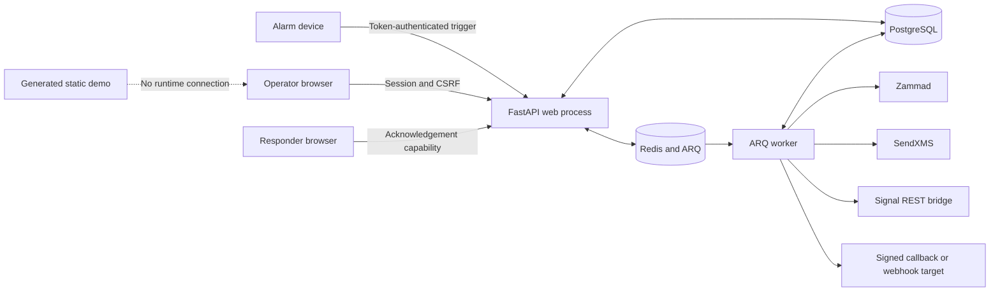
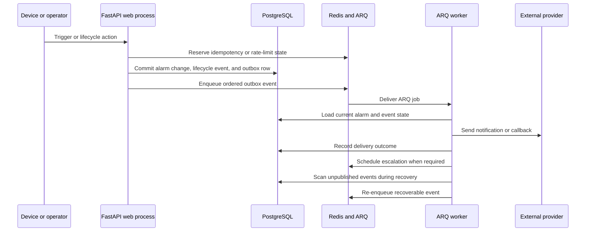

# Architecture

Escalane ships as one Python package but runs in three roles: an Alembic
migration process, a FastAPI web process, and an ARQ worker. All three use the
same installed package and container image. The application also depends on
PostgreSQL, Redis, and whichever notification providers a deployment enables.

This repository is a reference implementation for alarm intake and escalation.
It is neither a general incident-management platform nor a validated
emergency-response system.

## System context

Only the API accepts HTTP requests. The worker creates its own database engine,
HTTP client, provider clients, and Redis connection. In the reference Compose
deployment, the migration process updates the schema before either the API or
worker starts.

## Components

| Component | Responsibility |
|---|---|
| `config/`, `contracts/` | Load environment settings and define shared exceptions and stable data contracts |
| `persistence/` | Defines SQLAlchemy models, engines, sessions, and JSON merge behavior |
| `security/`, `runtime/` | Validate source IPs and outbound URLs, enforce rate limits, and coordinate atomic Redis operations |
| `providers/` | Connect to Zammad, SendXMS, Signal, webhooks, and the simulation mocks |
| `alarms/` | Handles trigger idempotency, alarm creation, lifecycle changes, enrichment, and the ordered outbox |
| `configuration/` | Imports seeds, manages master data and policies, and writes redacted administrative audit records |
| `notifications/` | Chooses targets, builds payloads, calls providers, recovers work, and records delivery results |
| `operations/` | Supplies metrics and operational queries |
| `web/` | Assembles the application and handles authentication, routes, Jinja rendering, translations, and assets |
| `worker/` | Runs ARQ jobs, dispatches events, schedules escalations, retries failures, and recovers outbox work |
| `migrations/` | Stores Alembic schema history; current code expects the packaged migration head |
| `pages/` | Contains the source for the separate, disconnected GitHub Pages demo |

Paths in the table are relative to `src/escalane/` unless shown otherwise.

## Dependency rules

`scripts/check_architecture.py` enforces the package boundaries. It rejects
dependencies that are absent from the table below, imports from removed or
unknown namespaces, and dependency cycles.

| Package | May import from |
|---|---|
| `config`, `contracts`, `runtime`, `security` | No other Escalane package |
| `persistence` | `config`, `contracts` |
| `providers` | `security` |
| `configuration` | `config`, `persistence` |
| `operations` | `contracts`, `persistence` |
| `alarms` | `config`, `contracts`, `operations`, `persistence`, `runtime` |
| `notifications` | `config`, `contracts`, `operations`, `persistence`, `providers`, `security` |
| `web` | `alarms`, `config`, `configuration`, `contracts`, `operations`, `persistence`, `providers`, `runtime`, `security` |
| `worker` | `alarms`, `config`, `contracts`, `notifications`, `operations`, `persistence`, `providers`, `security` |

The checker does not restrict imports within the same package. `web` and
`worker` are the two inbound adapters, so feature packages must not import
either one. Keep HTTP parsing, cookies, rendering, and response formatting in
`web`. Keep ARQ task signatures and scheduling in `worker`, and keep calls to
external systems in `providers`.

## Alarm and delivery flow

When Escalane creates or changes an alarm, it writes the lifecycle event and
outbox row in the same PostgreSQL transaction. It publishes each alarm's events
in order. Once ARQ accepts an event, Escalane marks the corresponding outbox row
as published. If enqueueing fails, the row stays in PostgreSQL for the worker to
recover at startup or during its once-per-minute recovery job.

The worker reloads the stored state before it acts. Initial notifications and
escalations may be retried, which makes calls to providers at least once rather
than exactly once. Stable job identities, current-state checks, retry
classification, and delivery records reduce duplicate effects, but a provider
can still receive the same request more than once.

## State ownership

| Store | What it stores | What happens during recovery |
|---|---|---|
| PostgreSQL | Master data, escalation policy and targets, alarms, notes, lifecycle events, administrative audit, notification audit, and ordered outbox | This is the durable source of truth. Back up and restore it consistently. |
| Redis | ARQ jobs, delayed work, browser sessions, CSRF/session data, trigger reservations, idempotency state, and rate limits | This data coordinates current work. A restart invalidates sessions and requires a tested queue recovery procedure. |
| Process memory | Simulation notification records and mock ticket counter | This data disappears with its process and is not shared between API and worker processes. |

If Redis restarts or ARQ retries a job, PostgreSQL remains the source of truth.
Simulation records exist only for the demonstration flow and cannot establish
that a provider received a delivery.

## HTTP and trust boundaries

| Endpoint | Access control |
|---|---|
| `/healthz`, `/readyz` | Public liveness and dependency/schema readiness |
| `/v1/yealink/alarm` | Per-device token, Redis-backed limit, and source allowlist outside simulation |
| `/a/{ack_token}` | Bearer capability; responses are marked no-store |
| `/v1/alarms`, `/v1/admin`, `/metrics`, `/healthz/details` | Static `X-Admin-Key` comparison |
| `/admin/*` | Admin-key login exchanged for a one-hour Redis session; mutating forms require CSRF |
| `/v1/simulation/*` | Admin key and simulation mode; routes return 404 when simulation is disabled |

Escalane trusts forwarded client and scheme headers only when the immediate peer
matches a configured proxy. It validates non-loopback `BASE_URL` values and
enabled provider URLs against their HTTPS and host-allowlist rules. Browser
assets remain on the same origin, and the application does not configure CORS.

## Configuration and deployment

Runtime settings live in `src/escalane/config/settings.py`. Process environment
variables take precedence over the optional `.env` file at the repository root,
and `.env.example` documents the available settings. On startup, Escalane
validates production credentials, source allowlists, whether simulation is
restricted to loopback, provider endpoints, and webhook controls.

The Dockerfile installs both the package and its migrations into one non-root
image. `deploy/docker-compose.yml` runs that image in the migration, API, and
worker roles alongside PostgreSQL and Redis. The API and worker wait for a
successful migration. This Compose setup is a reference deployment and does
not provide TLS termination, external monitoring, scheduled backups, or managed
secrets.

CI builds a wheel to verify package integrity, while the tested container image
is the supported release artifact. The `pages/` source builds separately into
the ignored `build/pages/` directory and may be published to GitHub Pages. The
static site never connects to a running Escalane service.

## Extending the application

- Put new provider transports behind the narrow protocols in `providers/`, and
  leave notification policy in `notifications/`.
- Add HTTP routes under `web/routes/` and register them explicitly in
  `ALL_ROUTERS`. Route handlers should translate HTTP requests rather than own
  domain policy.
- Register new worker behavior as ARQ functions without changing existing
  payload formats or job IDs.
- Represent each schema change with a new Alembic revision, and apply it before
  starting API or worker code that depends on it.
- Preserve existing HTTP routes, worker payloads, database schema, provider
  behavior, packaged templates and assets, and operator workflows unless a
  change explicitly updates them.

The [Setup](SETUP.md), [Operations](OPERATIONS.md),
[Integrations](INTEGRATIONS.md), and [Frontend](FRONTEND.md) guides cover the
corresponding developer and operator tasks.
